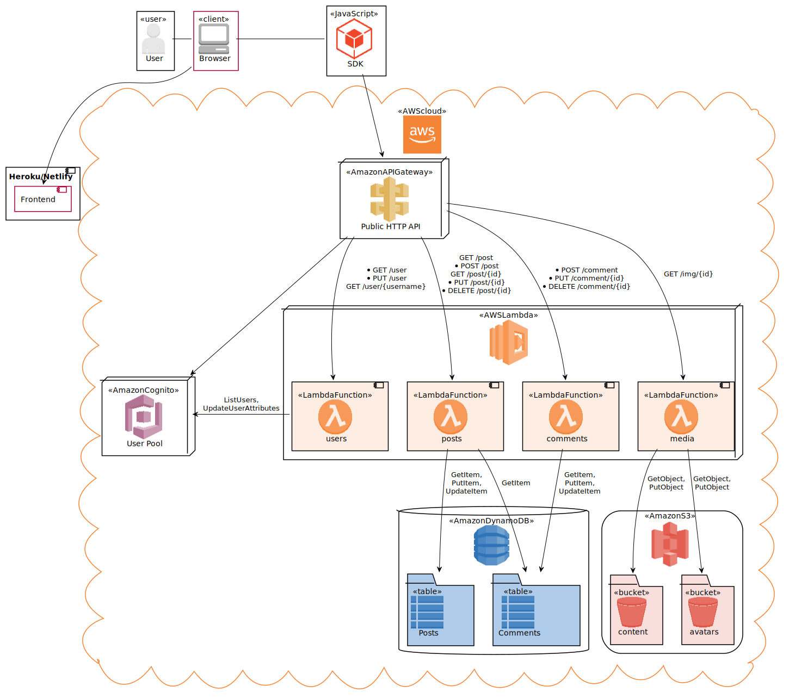

# sf-microblog
Serverless microblogging platform created with Serverless Framework and React.

## Deployment
App is divided into 2 stacks:
- `services/shared/serverless.yml`
  - API Gateway
  - Cognito User Pool, Client and Domain
  - DynamoDB tables
  - S3 buckets
- `services/api/serverless.yml`
  - Lambda functions
    
Api stack depends on services created by shared stack, therefore shared stack must be deployed before api stack.

## Front-end
Front-end application requires basic configuration by providing API Gateway endpoint URL and Cognito User Pool and Client IDs, as well as AWS regions. This is done in `front/src/config.ts` file. 
